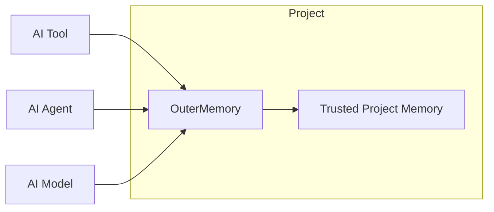

# OuterMemory

**A project-centric persistent memory layer for AI coding.**

> **Memory > Agent > Model**

OuterMemory keeps durable, trusted project knowledge in project-scoped Markdown files. It gives developers, agents, and models a shared memory layer that survives individual chat sessions, tools, model changes, and AI vendors.

Memory belongs to the project—not to a model, agent, developer, vendor, or individual conversation. Different developers and AI tools can therefore work with the same trusted project memory.

OuterMemory separates broad retrieval from trusted-memory write authority. AI can retrieve and use project knowledge; creation, modification, deletion, and merging of trusted long-term memory require explicit human approval.

## Why OuterMemory

AI coding tools can inspect current source code and use the current conversation, but durable project knowledge often disappears when a session ends or a team changes tools. Useful persistent context includes:

- project conventions and standards;
- architectural decisions and constraints;
- important variables, resources, and paths;
- project-specific operational knowledge.

OuterMemory provides one part of an intentional routing model:

```text
Persistent project context      -> OuterMemory
Current implementation facts    -> Repository inspection
General knowledge               -> Model
```

OuterMemory does not replace repository inspection. It also does not require external knowledge to be approved before an AI can use it; governance applies to persistence into trusted project memory.

## Quick Demo

From the repository root, retrieve the primary record in the synthetic demo project:

```text
python src/outermemory_cli.py --root examples/demo-memory retrieve v_DEMO_SESSION_POLICY --topk 1
```

Expected result:

```text
v_DEMO_SESSION_POLICY
-> exact ID match
-> score 11
```

Then retrieve the same record by alias and include its one-hop related records:

```text
python src/outermemory_cli.py --root examples/demo-memory retrieve session-policy --topk 3
```

Expected result:

```text
v_DEMO_SESSION_POLICY
-> direct alias match

r_DEMO_WORKSPACE
-> one-hop Related expansion

s_DEMO_CONVENTION
-> one-hop Related expansion
```

Retrieval is currently deterministic lexical retrieval, not semantic or vector retrieval. It does not modify the trusted Markdown memory records. It may update ignored governance runtime state under `.outermemory/` in the selected project root.

## Core Principles

### Project-centric memory

Memory belongs to the project. A project can retain its trusted knowledge while developers, agents, models, or vendors change.

### Memory > Agent > Model

Agents and models are replaceable. Trusted project memory persists independently of them.

### Broad retrieval, governed persistence

Retrieval authority and trusted-memory persistence authority are separate concerns. AI may retrieve broadly and propose changes; a human must explicitly approve a trusted-memory mutation.

### Human-governed trusted memory

AI can create pending proposals. Humans approve or reject proposals, and only approved proposals can be applied through the controlled mutation path.

### AI/model agnostic core

OuterMemory is a project-memory boundary, not a framework owned by one model vendor or agent. MCP provides one AI-agnostic integration surface.

### Traceability

Approved mutations are recorded in history, with snapshots for governed rollback. Attention requests, proposals, approvals, applications, and history remain distinct concepts.

## Architecture



## Retrieval

OuterMemory implements deterministic lexical retrieval over these trusted-memory fields:

- ID
- Aliases
- Description

Evidence ranks from strongest to weakest:

```text
Exact ID
    >
Exact alias
    >
Lexical ID match
    >
Lexical alias match
    >
Description lexical match
```

Equal relevance scores use logical memory ID ascending as a deterministic tie-breaker. Memory ID ordering is only a tie-breaker, not relevance evidence. Frequency and `last_used` are not retrieval relevance signals; retrieval frequency may instead be used by governance as an attention signal.

`Related` records expand one hop from a matched parent and remain secondary to direct results.

Current limitations are intentional and explicit:

- no semantic or vector retrieval;
- paraphrase-only and synonym-only queries may miss;
- cross-language queries may miss when memory is stored in another language;
- `Value` and `Guidelines` are not searchable retrieval fields.

## Governance

Trusted-memory mutation follows a separate lifecycle:

```text
Proposal
  -> Human Approval
  -> Controlled Application
  -> History
  -> Trusted Memory
```

`reviewed` is not `approved`. Governance-request review handles human attention; proposal approval authorizes a trusted-memory mutation. Risk affects human attention priority, not AI mutation authority.

OuterMemory has four governance attention channels:

1. accumulated low-risk retrieval signals;
2. contextual immediate self-check findings;
3. manual full-library scans;
4. startup scans when a successful scan is not recent.

Every trusted-memory creation, modification, merge, or deletion still requires a proposal, explicit human approval, controlled application, and history.

## Interfaces

### Python API

Use `OuterMemory(project_root)` for the AI-facing application interface:

```python
from outermemory import OuterMemory

memory = OuterMemory("/path/to/project")
results = memory.retrieve("session-policy", topk=3)
```

### JSON CLI

The JSON CLI exposes only AI-facing capabilities:

```text
python src/outermemory_cli.py --root /path/to/project retrieve "session-policy" --topk 3
python src/outermemory_cli.py --root /path/to/project propose create --category variables --id v_POLICY --change JSON_OBJECT
python src/outermemory_cli.py --root /path/to/project proposal-status PROPOSAL_ID
```

### MCP

The MCP server binds to one explicit project root:

```text
python src/outermemory_mcp.py --root /path/to/project
```

It exposes exactly these tools:

- `outermemory_retrieve`
- `outermemory_propose`
- `outermemory_proposal_status`

AI-facing interfaces do not expose `approve`, `reject`, `apply`, or `rollback`. Those remain human-governed operations through the separate human CLI.

## Active Retrieval

Active Retrieval is primarily an agent-integration policy, not an autonomous process or agent framework inside OuterMemory Core. An integrated coding agent decides when persistent project context is relevant and formulates the retrieval query.

```text
Persistent project context      -> OuterMemory
Current source implementation   -> Repository inspection
General knowledge               -> Model
```

Do not retrieve on every request. Codex has been validated as an integration example; the architecture remains AI-agnostic.

## Project Structure

```text
memory/                 Trusted project-memory Markdown records
src/                    Core library, CLIs, MCP adapter, and governance path
examples/demo-memory/   Standalone synthetic retrieval demo
tests/                  Unit, integration, and retrieval-quality tests
docs/                   Architecture and CLI documentation
```

## Current Status and Limitations

Implemented today:

- project-scoped Markdown memory with support for `variables`, `resources`, `functions`, and `standards`;
- deterministic lexical retrieval and one-hop Related expansion;
- Python API, JSON CLI, and MCP integration;
- governed proposals, human approval, controlled application, history, and rollback;
- retrieval-quality, root-isolation, adapter-boundary, and demo coverage.

Not implemented:

- semantic retrieval, embeddings, or a vector database;
- automatic query rewriting or synonym dictionaries;
- a GUI review console;
- universal cross-agent integrations.

## Notice

OuterMemory was developed with the assistance of AI coding tools.

AI tools were used during parts of the implementation, testing, documentation, and code review process. The project architecture, design decisions, governance model, and final acceptance of changes remain human-directed and human-reviewed.

AI-generated or AI-assisted changes are not treated as authoritative by default; they are reviewed and validated before being incorporated into the project.

## License

OuterMemory is released under the [MIT License](LICENSE).
