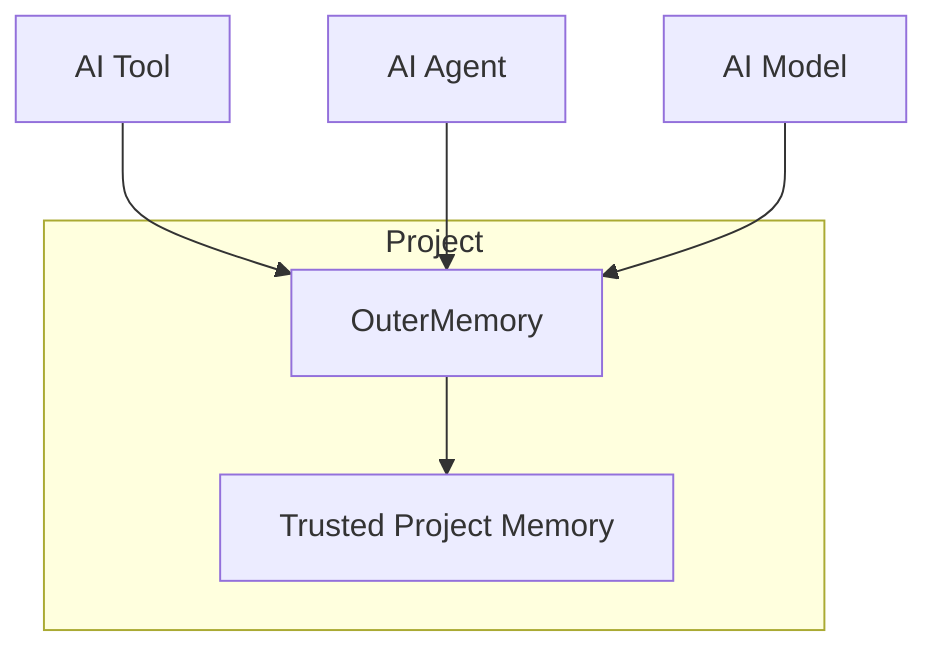
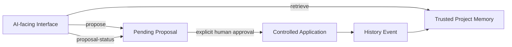

# OuterMemory

**Human-governed persistence with risk-aware attention management for AI coding.**

> **Memory > Agent > Model**

Coding agents and models are replaceable. Project memory should persist independently of them. OuterMemory keeps trusted project knowledge in project-scoped Markdown files, so the same memory can be used across AI tools, agents, models, and developers.

OuterMemory is project-centric, not user-centric: memory belongs to the project, not to a particular developer, agent, or model.



## The boundary

OuterMemory follows one principle: **broad retrieval, governed persistence**.

AI-facing callers can retrieve project memory broadly and create proposals. They cannot approve proposals, apply changes, or roll back history. Trusted memory changes only through explicit human governance.



## Governance attention channels

Governance has four attention channels, not four permission levels. In every channel, **all trusted-memory creation, modification, merge, and deletion still require a proposal, explicit human approval, controlled application, and history**.

```text
retrieval results ──> persistent retrieval totals ──> milestones 5, 10, 20, 40... ──> pending low-risk requests
                                                                                         │
                                                                                 announce each 10 once

current retrieval items ──────> contextual scope ──┐
                                                    ├─> shared Self-Check Engine ─> immediate request / grouped report
whole trusted-memory library ─> full-library scope ─┘                                      │
                                                                              proposal, if a human requests action
                                                                                             │
                                                                    human approval -> controlled application -> history
```

Retrieval counts, emitted milestones, announcement state, and request resolution are persisted separately in ignored runtime state (`.outermemory/governance.json`). A batch announcement does not resolve a request. The full scan is conservative: broken `Related` references are schema evidence; stale `last_used`, identical descriptions/shared aliases, and conflicting optional metadata are explicitly labeled heuristics rather than facts. It never changes trusted memory.

At startup OuterMemory runs the same scan only if `last_successful_scan` is absent or at least 24 hours old. That timestamp is written only after a complete successful scan; crashes, interruptions, and validation failures leave it unchanged and are retried on the next startup.

This separation is intentional:

- Retrieval authority and trusted-memory write authority are separate.
- Creating a proposal is not approval.
- Approval is not application.
- AI-facing interfaces do not expose `approve`, `reject`, `apply`, or `rollback`.
- Team use follows naturally from project-centric memory; it is not a separate collaboration feature.

## What is implemented

- Project-scoped Markdown memory in `memory/`, with schema-supported `variables`, `resources`, `functions`, and `standards` categories.
- Parsing, validation, ranked keyword retrieval, and related-memory expansion.
- A Python `OuterMemory` API and a machine-readable JSON CLI.
- Pending proposals with status inspection.
- Explicit human approval or rejection.
- Controlled mutation from approved proposals only, with validation and pre-mutation snapshots.
- History events, rollback, recovery handling, and blocking when recovery is required.
- An MCP adapter with stdio and Streamable HTTP transports.

## Governance flow

```text
AI proposes
  -> pending proposal
  -> explicit human approval
  -> controlled apply
  -> history event
  -> trusted project memory
```

The human-facing command interface supplies `approve`, `reject`, `apply`, and `rollback`. Approval and rejection require explicit confirmation; applying is allowed only for an approved proposal. Before an apply, OuterMemory snapshots affected trusted-memory paths and records a history event.

Rollback is also governed:

```text
human-confirmed rollback
  -> new history event
  -> trusted memory restored
```

Rollback preserves audit history rather than erasing it.

## Quick start

Run from a project repository containing a `memory/` directory. The Python source is kept in `src/` and uses the installed Python MCP SDK for MCP support.

Install the current MCP dependency when using MCP integration:

```text
python -m pip install mcp
```

Retrieve project memory through the JSON CLI:

```text
python src/outermemory_cli.py --root . retrieve "demo feature" --topk 3
```

The CLI prints JSON to standard output on success. It exposes only:

- `retrieve`
- `propose`
- `proposal-status`

For the full command arguments and output shapes, see [docs/cli.md](docs/cli.md).

## Python API

Use `OuterMemory` when calling the project-memory interface directly:

```python
from outermemory import OuterMemory

memory = OuterMemory("/path/to/project")
results = memory.retrieve("demo feature", topk=3)

proposal = memory.propose(
    "create",
    {"category": "variables", "id": "v_DEMO"},
    {"content": "...valid memory Markdown..."},
    "Record the project setting",
)
status = memory.proposal_status(proposal["proposal_id"])
```

When running this from the repository, make `src/` importable (for example, set `PYTHONPATH=src`). This API intentionally has no approval, rejection, application, or rollback methods.

## MCP integration

`src/outermemory_mcp.py` adapts one explicit project root to MCP. It exposes exactly three AI-facing tools:

- `outermemory_retrieve` -> `OuterMemory.retrieve(...)`
- `outermemory_propose` -> `OuterMemory.propose(...)`
- `outermemory_proposal_status` -> `OuterMemory.proposal_status(...)`

No MCP tool can approve, reject, apply, or roll back memory changes.

### Stdio

Stdio is the default transport and is suitable for MCP clients that launch a local server process:

```text
python src/outermemory_mcp.py --root /path/to/project
```

Codex integration has been verified end-to-end through MCP stdio. MCP remains an AI-agnostic integration boundary rather than a Codex-specific feature.

### Streamable HTTP

Run the same server over Streamable HTTP:

```text
python src/outermemory_mcp.py --root /path/to/project --transport streamable-http
```

The default endpoint is `http://127.0.0.1:8000/mcp`. `--host`, `--port`, and `--path` override those defaults.

## Human governance commands

From the project repository, the separate human-facing entry point is:

```text
python src/main.py approve PROPOSAL_ID
python src/main.py reject PROPOSAL_ID
python src/main.py apply PROPOSAL_ID
python src/main.py rollback EVENT_ID
python src/main.py scan
python src/main.py requests
```

These commands are deliberately outside the AI-facing API, CLI, and MCP surfaces.

`scan` performs the manual full-library read-only scan. `scan ISSUE_TYPE` reviews the latest scan group and `scan FINDING_ID` reviews one finding. `requests [ISSUE_TYPE]`, `request REQUEST_ID`, and human-confirmed `resolve-request REQUEST_ID` inspect and explicitly handle governance requests. Resolving a request does not alter trusted memory; a change prompted by a finding must still be submitted through `propose` and then approved and applied by a human.

Human reviewers may run `approve-all PROPOSAL_ID...` or `reject-all PROPOSAL_ID...` for proposal groups. Governance-request groups use `review-all REQUEST_ID...` or `dismiss-all REQUEST_ID...`: those words deliberately describe attention handling, not mutation authorization. Each bulk operation requires a typed secondary confirmation. Individual review can stop and resume later; unnamed items remain pending. Proposal approval never applies a mutation.

## Testing

Run the full suite with:

```text
python -m unittest discover -s tests -v
```

The suite covers retrieval, proposal governance, controlled mutation and recovery, rollback, the JSON CLI, and MCP tool and transport selection.

## Notice

OuterMemory was developed with the assistance of AI coding tools.

AI tools were used during parts of the implementation, testing, documentation, and code review process. The project architecture, design decisions, governance model, and final acceptance of changes remain human-directed and human-reviewed.

AI-generated or AI-assisted changes are not treated as authoritative by default; they are reviewed and validated before being incorporated into the project.

## License

OuterMemory is released under the [MIT License](LICENSE).
